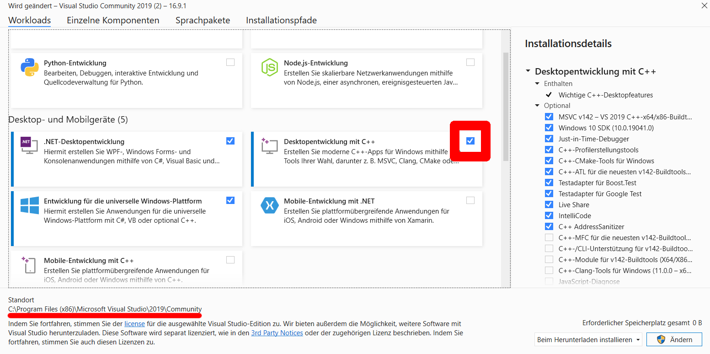

# Cross-Plattform inline assembler

## Usage

### Windows

-   Install Visual Studio 2019 Community edition
    -   During installation make sure to set the correct path and select C++-Development (see red marked in screenshot below)
        
-   Double click `_generateWindows.bat`
    -   If not opened automatically, open `InlineAssembler.sln` in Visual Studio 2019 after generation is done
-   Develop the application starting in `main.cpp` (in the `InlineTest` project in the opened Visual Studio project)

### Unix (Linux, OSX, ...)

-   Execute `_generateUnix.sh` (You might need to set the executable bit)
-   Follow the instuctions in the console
-   Once done, you can develop starting in `main.cpp`, build using `make` and then execute with `./InlineTest`
